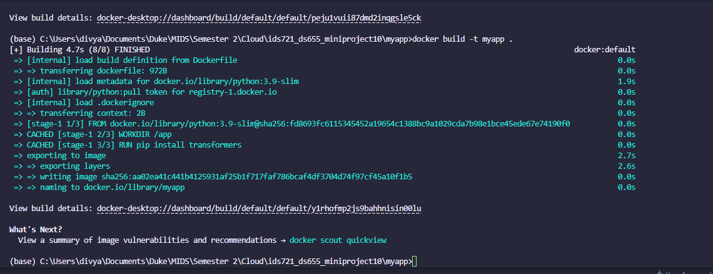
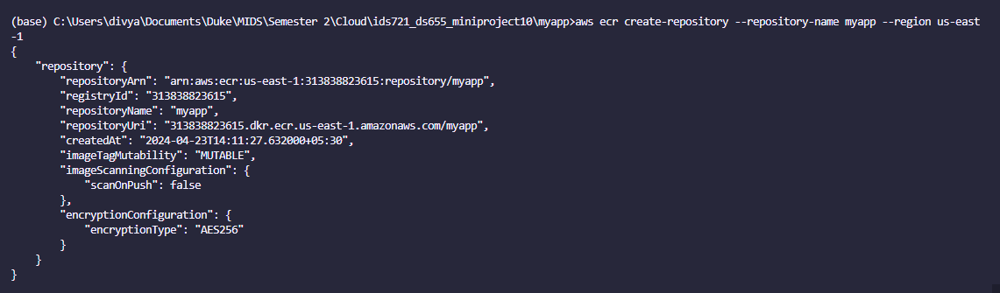
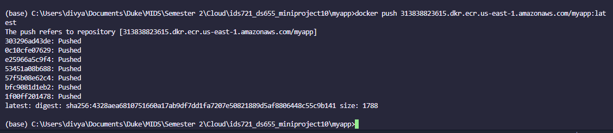

# Rust Serverless Transformer Endpoint

This project demonstrates how to dockerize a Hugging Face Rust transformer, deploy the container to AWS Lambda, and implement a query endpoint.

## Project Requirements

- Dockerize Hugging Face Rust transformer
- Deploy container to AWS Lambda
- Implement query endpoint

## Grading Criteria

- Transformer packaging: 30%
- Serverless deployment: 30%
- Endpoint functionality: 30%
- Documentation: 10%

## Deliverables

- Dockerfile and Rust code
- Screenshot of AWS Lambda
- cURL request against endpoint

## Demo

### Step 1: Dockerize Hugging Face Rust transformer

We created a Dockerfile for the Rust application. Here's the Dockerfile:

```Dockerfile
FROM rust:1.55.0 as builder
WORKDIR /usr/src/myapp
COPY . .
RUN cargo install --path .

FROM debian:buster-slim
RUN apt-get update && apt-get install -y libssl-dev
COPY --from=builder /usr/local/cargo/bin/myapp /usr/local/bin/myapp
CMD ["myapp"]
```

### Step 2: Deploy container to AWS Lambda

The Docker container was deployed to AWS Lambda. To do this, first a repository was created and then the Docker image was pushed to the ECR repository with the following commands:

First, we login to aws ecr:
```
aws ecr get-login-password --region us-east-1 | docker login --username AWS --password-stdin 313838823615.dkr.ecr.us-east-1.amazonaws.com
```

Then, we build the Docker image
``` bash
docker build -t 313838823615.dkr.ecr.us-east-1.amazonaws.com/myapp:latest .
```


Then, we create a new repository 
``` bash
aws ecr create-repository --repository-name myapp --region us-east-1
``` 


Finally, push the Docker image to the repository
``` bash
docker push 313838823615.dkr.ecr.us-east-1.amazonaws.com/myapp:latest
```


Then, we created a new Lambda function and specified the Docker image as the code.

### Step 3: Implement query endpoint

A new Rust project was created and AWS API Gateway was used to create a new API endpoint that triggers the Lambda function. The API was deployed with the following command:

```
aws apigateway create-deployment --rest-api-id your-rest-api-id --stage-name prod
```

#### Screenshots
Here's a screenshot of the AWS Lambda function:


#### Testing
The endpoint was tested using the following cURL command:

```
curl -X GET 'https://your-api-gateway-url/prod/myapp'
```
